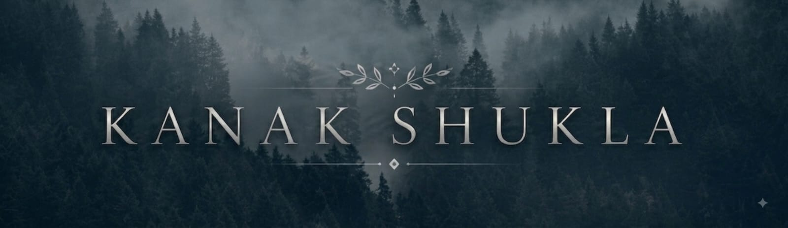

<div align="center">



<br/>

<a href="https://github.com/Kanakshukla29"></a>
<a href="https://linkedin.com/in/kanakshukla29"></a>
<a href="https://kanak-portfolio-taupe.vercel.app/"></a>
<a href="mailto:kanakshukla610@gmail.com"></a>

<br/><br/>


</div>

---

## About Me

I'm an **AI & Data Science focused developer** interested in turning data and ideas into useful products.

- 📊 Data Analytics & Business Intelligence
- 🤖 Machine Learning & Deep Learning
- 👁️ Computer Vision
- 🌐 Full-Stack & API Development
- 🧪 Practical AI experimentation

I enjoy building systems that combine **data, intelligent models, and clean user experiences**.

---

## Tech Stack

### Languages
<p align="center">

</p>

### Data & AI
<p align="center">

</p>

### Web & Backend
<p align="center">

</p>

### Databases & Engineering
<p align="center">

</p>

### Analytics
<p align="center">


</p>

---

## What I Build

<div align="center">

| 📊 Data Analytics | 🤖 AI / ML | 👁️ Computer Vision |
|:---:|:---:|:---:|
| EDA & Dashboards | Prediction | OpenCV |
| KPI Analysis | Deep Learning | MediaPipe |
| Business Insights | Model Experiments | Image Processing |

| 🌐 Web | ⚙️ Backend | 🚀 Engineering |
|:---:|:---:|:---:|
| React & Tailwind | FastAPI & Flask | Git & Docker |
| Modern UI | REST APIs | Deployment |
| Responsive Apps | Auth & Databases | Clean Architecture |

</div>

---

## GitHub Analytics

<div align="center">


<br/><br/>


<br/><br/>


</div>

---

## Achievements

<div align="center">

</div>

---

## Current Focus

```text
DATA ANALYTICS       →  INSIGHTS
MACHINE LEARNING     →  INTELLIGENCE
COMPUTER VISION      →  PERCEPTION
WEB DEVELOPMENT      →  PRODUCTS
ENGINEERING          →  SHIPPING
```

> Build useful things. Understand how they work. Keep improving.

---

## Let's Connect

<div align="center">

<a href="https://linkedin.com/in/kanakshukla29"></a>
<a href="https://kanak-portfolio-taupe.vercel.app/"></a>
<a href="mailto:kanakshukla610@gmail.com"></a>

<br/><br/>

`© Kanak Shukla • Data • AI • Engineering`

</div>
